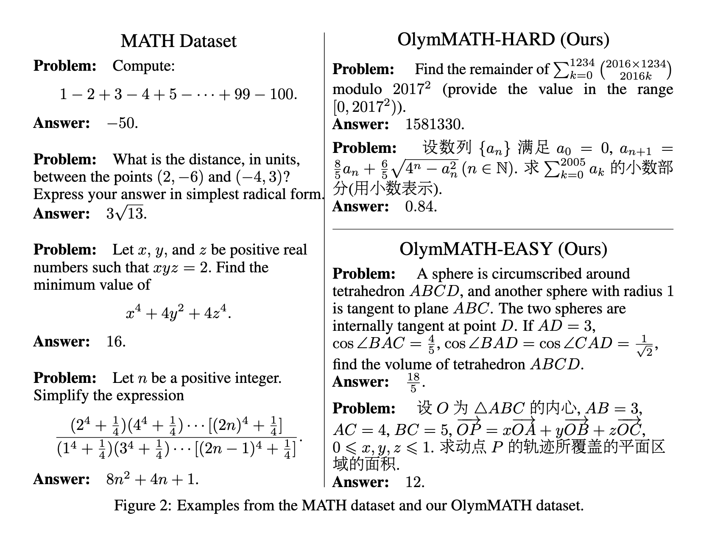
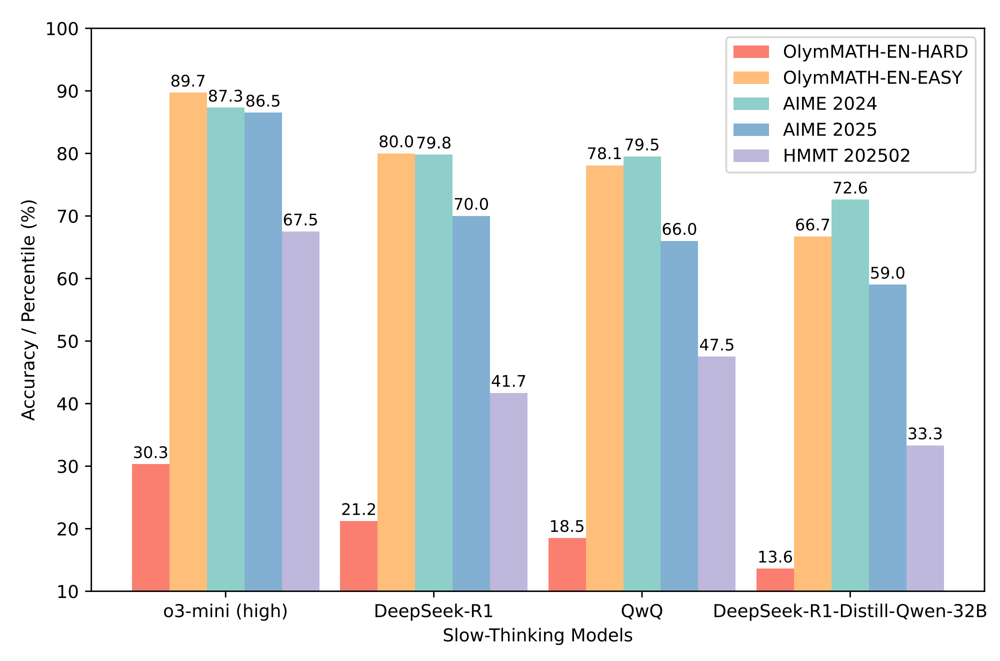

# Challenging the Boundaries of Reasoning: An Olympiad-Level Math Benchmark for Large Language Models

This is a mirror repository for [Challenging the Boundaries of Reasoning: An Olympiad-Level Math Benchmark for Large Language Models](https://arxiv.org/abs/2503.21380) by [Haoxiang Sun](https://github.com/CoderBak), Yingqian Min, Zhipeng Chen, Wayne Xin Zhao, Zheng Liu, Zhongyuan Wang, Lei Fang, and Ji-Rong Wen.

Please refer to our full repo on [RUCAIBox/OlymMATH](https://github.com/RUCAIBox/OlymMATH) for more information.

The dataset is also available now on [HuggingFace](https://huggingface.co/datasets/RUC-AIBOX/OlymMATH) 🤗.



## Experiment Results

Please refer to our paper for more detailed results.



## Evaluation

We have released code for local evaluation based on [Math-Verify](https://github.com/huggingface/Math-Verify) and [vLLM](https://github.com/vllm-project/vllm). You can follow these steps to evaluate your own model.

> [!NOTE]
>
> Setting an insufficient `max_tokens` value may prevent models from completing their reasoning and producing the final boxed answer. For complex mathematical problems, consider allocating a generous token budget to ensure complete responses.

```text
# Create a new Python environment (you can also use uv or other tools)
conda create -n olymmath python=3.10
conda activate olymmath

# Install necessary dependencies
pip install transformers vllm math-verify

# Evaluate the model on the EN-EASY dataset, Problem [0, 5)
python local_tester.py \
    --model /models/QwQ-32B \  #  Specify model path
    --gpus 4 \                 #  Number of GPUs to use
    --min 0 \                  #  Starting problem index
    --max 5 \                  #  Ending problem index
    --sample 10 \              #  Number of samples, to calculate pass@1, cons@x
    --temperature 0.6 \        #  Temperature
    --max_tokens 32768 \       #  Max tokens
    --dataset EN-EASY          #  Evaluation subset, you can choose EN/ZH-EASY/HARD
```

> [!WARNING]
>
> If you are using an API to test model performance, ensure you have set a sufficient timeout duration. Since reasoning models generate numerous tokens when solving problems in our dataset, an inadequate timeout setting may cause requests to terminate prematurely, preventing you from obtaining complete results. We recommend extending the timeout based on problem complexity to ensure the model has ample time to complete its entire reasoning process and generate the final answer.
