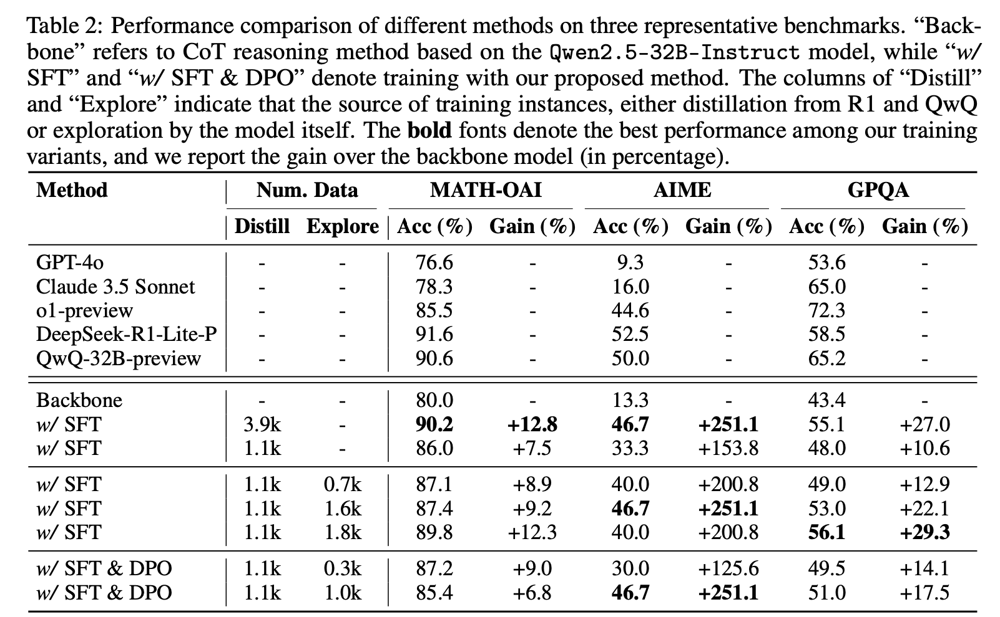
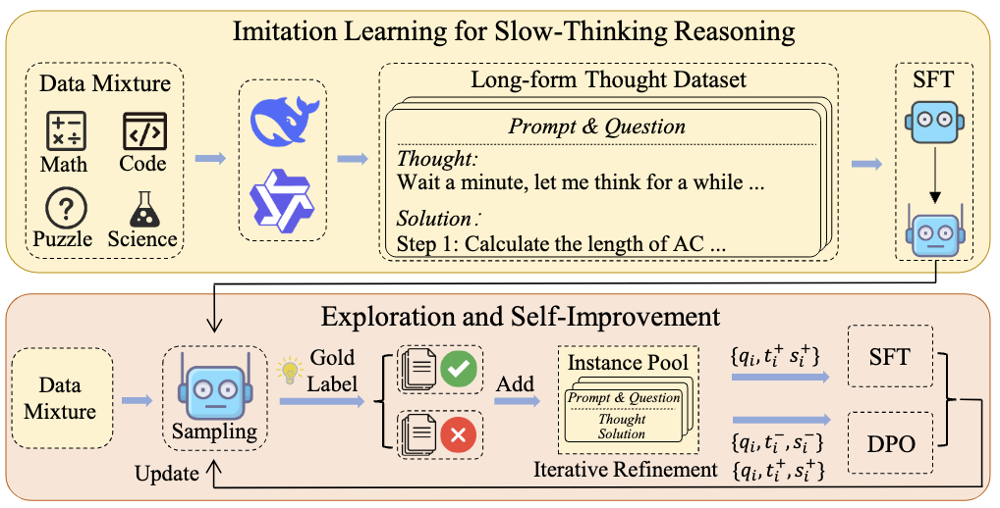
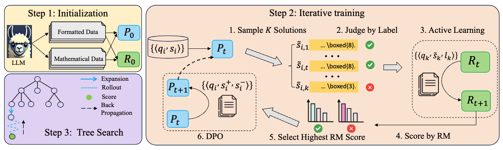

# Slow Thinking with LLMs
## News

+ [13 Dec 2024] We preliminarily reproduce **a slow-thinking reasoning system**, achieving competitive performance compared to industry-level reasoning systems on these benchmarks! And we also release the [technical report](https://arxiv.org/pdf/2412.09413), which presents the details about our reproduction.
+ [18 Nov 2024] We release our first [technical report](https://arxiv.org/abs/2411.11694), where we leverage **reward-guided tree search algorithm** to assist LLM reasoning process and largely enhance the performance of LLM on complex reasoning tasks.

## Technical Report

### Imitate, Explore, and Self-Improve: A Reproduction Report on Slow-thinking Reasoning Systems [[Report]](https://arxiv.org/pdf/2412.09413)

+ Slow-thinking reasoning systems, such as o1, have demonstrated remarkable capabilities in solving complex reasoning tasks, and are primarily developed and maintained by industry, with their core techniques not publicly disclosed. This paper presents a reproduction report on implementing o1-like reasoning systems. We introduce an **imitate, explore, and self-improve framework** as our primary technical approach to train the reasoning model. In the initial phase, we use distilled long-form thought data to fine-tune the reasoning model, enabling it to invoke a slow-thinking mode. The model is then encouraged to explore challenging problems by generating multiple rollouts, which can result in increasingly more high-quality trajectories that lead to correct answers. Furthermore, the model undergoes self-improvement by iteratively refining its training dataset.
  

  

### Enhancing LLM Reasoning with Reward-guided Tree Search [[Report]](https://arxiv.org/abs/2411.11694)

+ Recently, test-time scaling has garnered significant attention from the research community, largely due to the substantial advancements of the o1 model released by OpenAI. However,  develop an o1-like reasoning approach is challenging, and  researchers have been making various attempts to advance this open area of research. In this paper, we present a preliminary exploration into enhancing the reasoning abilities of  LLMs through **reward-guided tree search algorithms**. This framework is implemented by integrating the policy model, reward model, and search algorithm. It is primarily constructed around a tree search algorithm, where the policy model navigates a dynamically expanding tree guided by a specially trained reward model. 

  

## Future Work

Despite the promising results, our exploration remains preliminary, and there is still a substantial capacity gap compared to industry-level systems. As future work, we plan to investigate how to scale our training approach and extend its capacity to more complex tasks. 

As always, we are committed to keeping our technical approach *open*, and we will release the data, model, and other resources. We welcome collaboration and support in computational resources.

## Reference

Please kindly cite our reports if they are helpful for your research.

```
@article{Slow_Thinking_with_LLMs_1,
  title={Enhancing LLM Reasoning with Reward-guided Tree Search},
  author={Jiang, Jinhao and Chen, Zhipeng and Min, Yingqian and Chen, Jie and Cheng, Xiaoxue and Wang, Jiapeng and Tang, Yiru and Sun, Haoxiang and Deng, Jia and Zhao, Wayne Xin and Liu, Zheng and Yan, Dong and Xie, Jian and Wang, Zhongyuan and Wen, Ji-Rong},
  journal={arXiv preprint arXiv:2411.11694},
  year={2024}
}
```

```
@article{Slow_Thinking_with_LLMs_2,
  title={Imitate, Explore, and Self-Improve: A Reproduction Report on Slow-thinking Reasoning Systems},
  author={Min, Yingqian and Chen, Zhipeng and Jiang, Jinhao and Chen, Jie and Deng, Jia and Hu, Yiwen and Tang, Yiru and Wang, Jiapeng and Cheng, Xiaoxue and Song, Huatong and Zhao, Wayne Xin and Liu, Zheng and Wang, Zhongyuan and Wen, Ji-Rong},
  journal={arXiv preprint arXiv:},
  year={2024}
}
```

