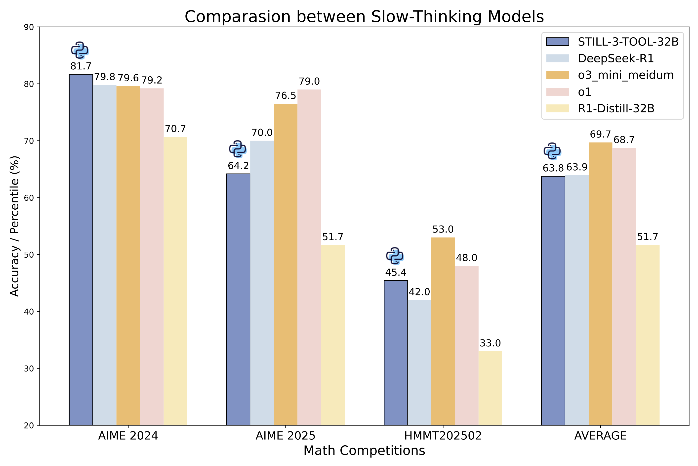

# STILL-3-TOOL-32B

## Introduction

<div align="center">
    
</div>

We propose `STILL-3-Tool-32B`, leveraging python code to help the reasoning process. During evaluation, `STILL-3-Tool-32B` achieves 81.70% accuracy on AIME 2024, matching the performance of `o3-mini`, outperforming `o1` and `DeepSeek-R1`.

## Usage

### Environment Setup
> Note: the version of `vllm` is important:)

```bash
conda create --name STILL-3-TOOL python=3.10.16
pip install vllm==0.6.5
pip install packaging
pip install ninja
pip install flash-attn --no-build-isolation
pip install deepspeed
pip install accelerate
pip install datasets
```

### Training
> Note: we provide detailed instructions in scripts:)

```bash
cd STILL-3-TOOL

## Multi Node
bash scripts/launch.sh

```

### Evaluation
> Note: we provide detailed guidelines in scripts:)

```bash
cd STILL-3-TOOL/evaluation

bash scripts/eval_tool.sh

```
