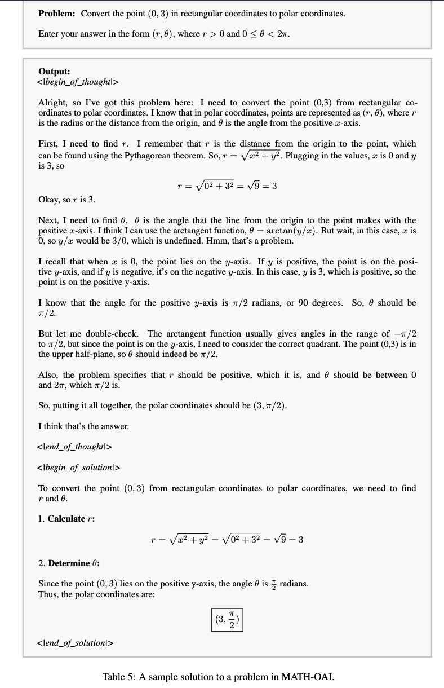

# Data Format Description

This document introduces the format of the data, which is stored as a JSONL (JSON Lines) file. Each line is a dictionary containing the following three keys:

- **question**: This is the question being asked.
- **combined_text**: This is the model's response, which is divided into two parts:
  - **thought**: The model's long-term thought process.
  - **solution**: The model's final solution.
- **domain**: This field indicates the domain of the question, which includes the following categories:
  - math
  - physics
  - chemistry
  - biology
  - code
  - puzzle

## Example

Here is an example entry:

```json
{
  "question": "How do you solve this equation?",
  "combined_text": 
    "<|begin_of_thought|>\n\nlong-form thought\n\n<|end_of_thought|>\n\n<|begin_of_solution|>solution<|end_of_solution|>",
  "domain": "math"
}
```

Here is an example of complete long-form thought data:

